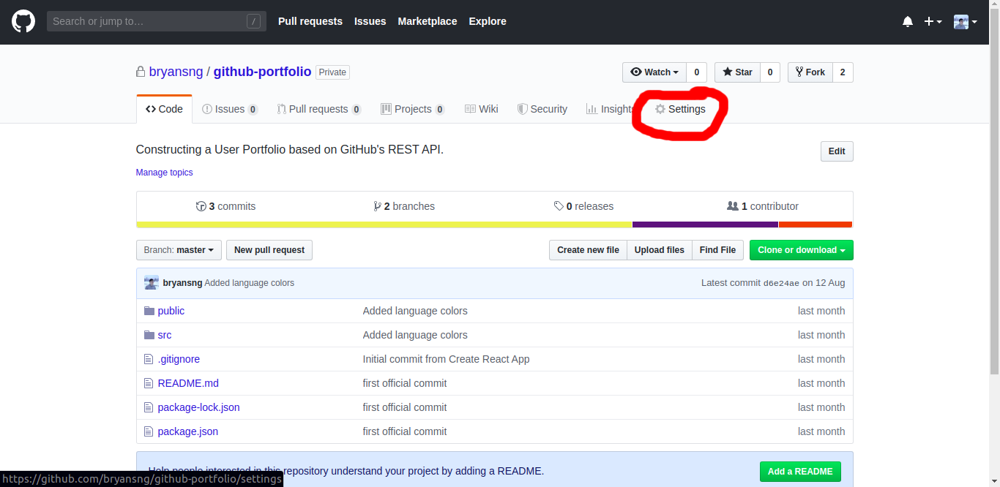
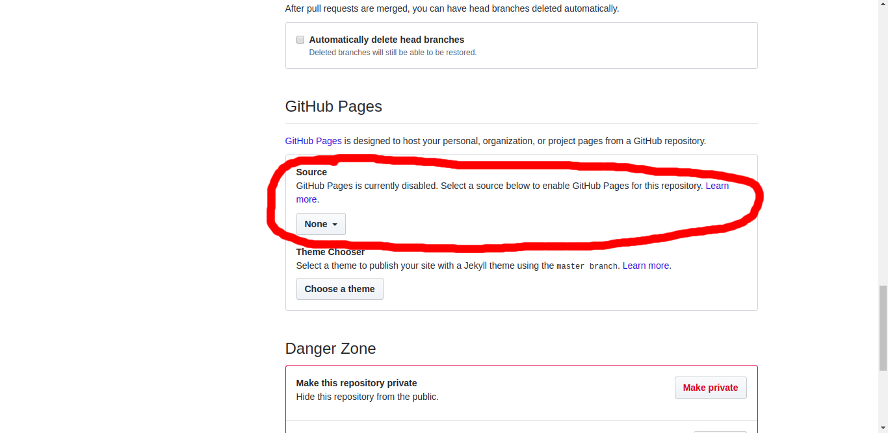
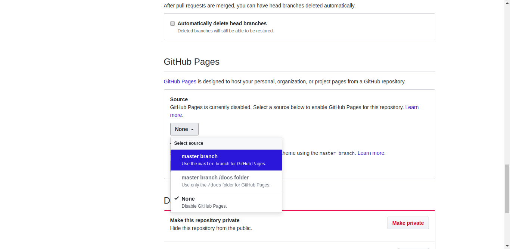
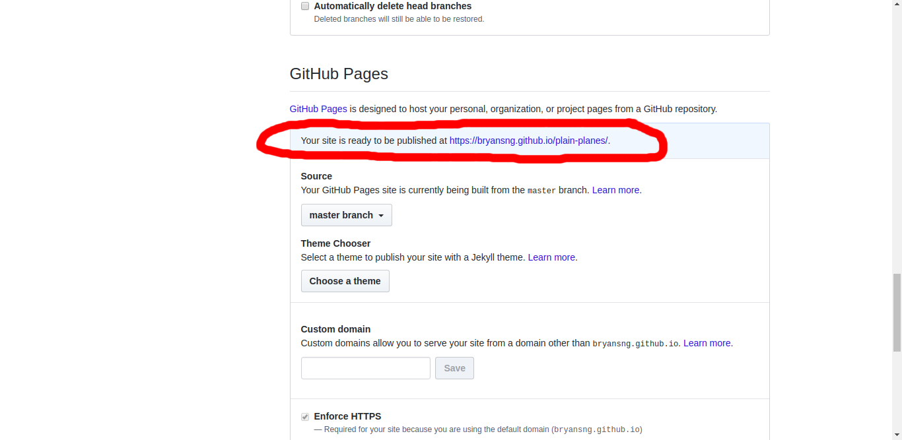

# Part 1 - Hand Coding <!-- omit in toc -->

## Workshop Goal <!-- omit in toc -->


<!-- TABLE OF CONTENTS -->
## Table of Contents <!-- omit in toc -->
- [Getting Started (< 15 minutes)](#getting-started--15-minutes)
	- [Prerequisites (< 5 minutes)](#prerequisites--5-minutes)
	- [Installation (< 10 minutes)](#installation--10-minutes)
		- [1. Fork the repo](#1-fork-the-repo)
		- [2. Open your terminal/command prompt.](#2-open-your-terminalcommand-prompt)
		- [3. Clone/Download the repository into a folder in your local computer](#3-clonedownload-the-repository-into-a-folder-in-your-local-computer)
		- [4. Update git remote](#4-update-git-remote)
		- [5. Open the index.html file in your browser.](#5-open-the-indexhtml-file-in-your-browser)
- [Tasks (< 35 minutes)](#tasks--35-minutes)
	- [1. Reconstruct topBar in index.html (< 15 minutes)](#1-reconstruct-topbar-in-indexhtml--15-minutes)
	- [2. Change all Logo Icon Background from Square to Circle. (< 5 minutes)](#2-change-all-logo-icon-background-from-square-to-circle--5-minutes)
	- [3. Add your projects info card by card. (< 10 minutes)](#3-add-your-projects-info-card-by-card--10-minutes)
	- [4. Deploying with GitHub pages. (< 5 minutes)](#4-deploying-with-github-pages--5-minutes)

<br />

<!-- GETTING STARTED -->
## Getting Started (< 15 minutes)
### Prerequisites (< 5 minutes)

* [Install Git](https://git-scm.com/downloads)
* [GitHub account](https://github.com/)

<br />

### Installation (< 10 minutes)
 
#### 1. Fork the repo

 
#### 2. Open your terminal/command prompt.

#### 3. Clone/Download the repository into a folder in your local computer
```sh
git clone https://github.com/your_username/forked-repo-name.git
```


#### 4. Update git remote
```sh
git remote set-url origin https://github.com/your_username/forked-repo-name.git
```

#### 5. Open the index.html file in your browser.
- Copy the path of your index.html file, paste it into the browser's search bar.
- Refresh the page every time you change something in the file.

<br />

<!-- TASKS -->
## Tasks (< 35 minutes)

### 1. Reconstruct topBar in index.html (< 15 minutes)
<p>@index.html


ImageContainer
```html

```

UserInfo
```html
<div class="userInfo">
	<span class="userName">Ham McSter</span>
	<span>@</span>
	<span>UCD, Dublin, Ireland</span>
	<!-- Something was here, determine based on the above image. -->
</div>
```
<!-- I am one of many, bound by a set of rules, I am either spoken or written, people know me well enough as means to communication, what am I? -->

Languages
```html
<div class="topLanguages">
	<span class="topLanguage">
		HTML
	</span>
	<span class="topLanguage">
		CSS
	</span>
	<span class="topLanguage">
		JavaScript
	</span>
	<span class="topLanguage">
		PHP
	</span>
</div>
```

SocialMedia
```html
<!-- User's Social Media
NOTE: The SVGs reference code from the very bottom of index.html.
-->
<div class="socialMedia">
	<a href="https://github.com" class="logoLink" target="_blank" alt="GitHub">
		<div class="logo">              
			<svg xmlns="http://www.w3.org/2000/svg" viewBox="0 0 200 200">
				<use xlink:href="#github"></use>
			</svg>
		</div>
	</a>
	<a href="https://linkedin.com" class="logoLink" target="_blank" alt="LinkedIn">
		<div class="logo">              
			<svg xmlns="http://www.w3.org/2000/svg" viewBox="0 0 200 200">
				<use xlink:href="#linkedin"></use>
			</svg>
		</div>
	</a>
	<a href="https://hackerrank.com" class="logoLink" target="_blank" alt="HackerRank">
		<div class="logo">              
			<svg xmlns="http://www.w3.org/2000/svg" viewBox="0 0 200 200">
				<use xlink:href="#hackerrank"></use>
			</svg>
		</div>
	</a>
	<a href="https://twitter.com" class="logoLink" target="_blank" alt="Twitter">
		<div class="logo">              
			<svg xmlns="http://www.w3.org/2000/svg" viewBox="0 0 200 200">
				<use xlink:href="#twitter"></use>
			</svg>
		</div>
	</a>
</div>
```

1. Scroll down to the body tag of index.html.
2. There you will find a commented section asking for help.
3. `git add .`
4. `git commit -m "reconstructed topBar"`

NOTE:
- You are only required to construct the topBar with the codes given by referencing the template image.
- CSS Classes like topBar, topBarWrapper and user are already written for you, you can just use them (i.e. `<div class="topBar"> some child components </div>`).</p>
<br />


### 2. Change all Logo Icon Background from Square to Circle. (< 5 minutes)
<p>@index.html


Square
```html
<rect style="fill:#eee" x="0" y="0" rx="25" ry="25" width="200" height="200"></rect>
```

Circle
```html
<circle style="fill:#eee" cx="100" cy="100" r="80"></circle>
```

Currently, we use the Square code as the background for all Logo Icons.

1. CTRL+F to find Task 2 / Scroll all the way down to "Start of Task 2".
2. Replace all Square code with Circle code.
3. `git add .`
4. `git commit -m "changed logo background from square to circle"`

NOTE:
- Tedious as it is, you could replace the rect in  each icon one at a time, or use the CTRL+H (replace feature) to replace all of them.
<br /><br />
- Notice how this doesn't scale, to change one thing about the Logo, you have to change all of them. <br /><br /> In part 2, we will show you how to do this by changing only one word of code. </p>
<br />


### 3. Add your projects info card by card. (< 10 minutes)
<p>@index.html

Card Template
```html
<!-- start of card -->
<div class="card">
	<div class="cardWrapper">
		<span class="top">
			<!-- Doc icon -->
			<div class="doc">
				<svg xmlns="http://www.w3.org/2000/svg" viewBox="0 0 12 16">
					<use xlink:href="#doc"></use>
				</svg>
			</div>
			
			<!-- GitHub icon and External Link icon -->
			<span class="flexRow">
				<a href="https://github.com" class="logoLink" target="_blank" alt="GitHub">
					<div class="logo">
						<svg xmlns="http://www.w3.org/2000/svg" viewBox="0 0 200 200">
							<use xlink:href="#github"></use>
						</svg>
					</div>
				</a>
				<a href="https://randomlink.com" class="logoLink" target="_blank" alt="External Link">
					<div class="logo">
						<svg xmlns="http://www.w3.org/2000/svg" viewBox="0 0 200 200">
							<use xlink:href="#externallink"></use>
						</svg>
					</div>
				</a>
			</span>
		</span>

		<!-- Repository name and description -->
		<h3 class="name">Hamster Wheel</h3>
		<p class="desc">A circular cage for a hamster or other small rodent, which rotates vertically as the animal runs at the bottom. </p>

		<!-- Repository stats: stars, forks, size, top languages -->
		<span class="bottom">
			<span class="flexBetween">
				<!-- Change size here. -->
				<span class="size ">512 KB</span>
				<span class="flexRow">
					<span class="stars">
							<div class="star">
								<svg xmlns="http://www.w3.org/2000/svg" viewBox="0 0 14 16">
									<use xlink:href="#star"></use>
								</svg>
							</div>
							<!-- Change star here. -->
							&nbsp;4
					</span>
					<span class="forks">
						<div class="fork">
							<svg xmlns="http://www.w3.org/2000/svg" viewBox="0 0 10 16">
								<use xlink:href="#fork"></use>
							</svg>
						</div>
						<!-- Change fork here. -->
						&nbsp;5
					</span>
				</span>
			</span>
			<!-- Change languages here. -->
			<div class="languages">
				<span class="language">Python</span>
				<span class="language">C</span>
				<span class="language">Java</span>
			</div>
		</span>
	</div>
</div>
<!-- end of card -->
```

1. Scroll down to the div tag with class 'repoList' in the body tag of index.html.
2. There you will find a commented section asking you to rebuild it.
3. Copy, paste and modify the card template above with your project data.
4. Remove the sample card 1 and card 2 when you are done.
5. `git add .`
6. `git commit -m "updated repoList with my own project info"`

NOTE:
- Imagine if you were to update this in the future, you will have to come back to index.html just to find the specific card and edit it. <br /><br /> In part 2, we will leverage the power of REST API calls to do this for you.</p>
<br />


### 4. Deploying with GitHub pages. (< 5 minutes)
<p>

1. `git push -u master`
2. Go to your forked GitHub repository page.
3. Click on the settings tab. 
4. Scroll down to GitHub pages. 
5. Select the branch source to serve the website from. 
6. Once clicked, it will notify you that your settings has been saved.
7. Scroll back down to GitHub Pages and open the URL it is serving the website from. 
</p>
<br />